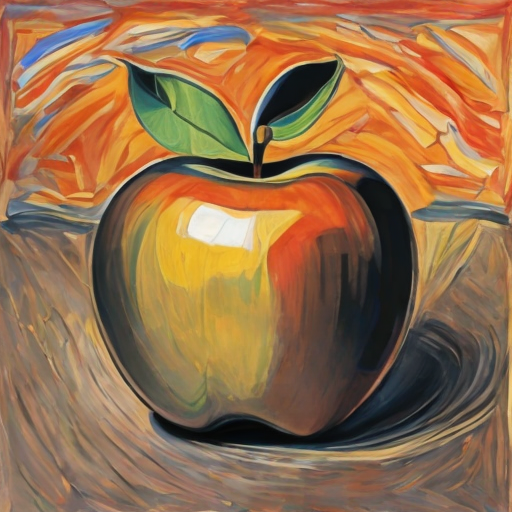
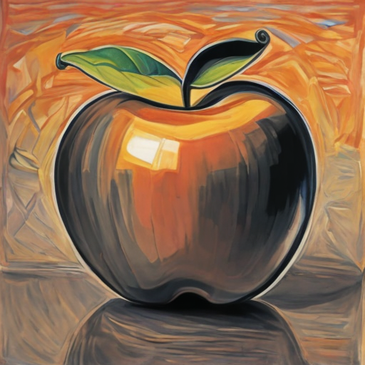

# Jittor 底层开发人员战队  Guided Dora
## 简介
本方法由三大部分构成：

1. **改进 LoRA 为 DoRA**
2. **基于最优化控制的引导**
3. **提示词工程的语义与风格的解耦**

### DoRA 部分

请参考原论文

### 基于最优控制的引导：

扩散模型由两个随机过程组成：

(a) **噪声添加过程**，由一个被称为前向SDE的随机微分方程(SDE)建模：

$$dX_t = f(X_t,t) dt + g(X_t,t) dW_t, X_0 \sim p_0,$$

(b) **去噪过程**，由前向SDE的时间反转在轻微正则化条件下建模，也称为反向SDE：

$$dX_t = [f(X_t,t) - g^2(X_t,t)\nabla \log p(X_t,t)] dt + g(X_t,t) dW_t, \quad X_1 \sim \mathcal{N}(0,I_d). \tag{1}$$

这里，$W = (W_t)_{t\geq0}$ 是在滤波概率空间 $(\Omega, \mathcal{F}, (\mathcal{F}_t)_{t\geq0}, \mathcal{P})$ 上的标准布朗运动，$p(\cdot,t)$ 表示 $p$ 在时间 $t$ 的边缘密度，$\nabla \log p_t(\cdot)$ 为相应的得分函数。$f(X_t,t)$ 和 $g(X_t,t)$ 分别称为漂移项和波动率。$f(X_t,t) = -X_t$ 和 $g(X_t,t) = \sqrt{2}$ 是一个流行的选择，对应于著名的前向Ornstein-Uhlenbeck (OU)过程。

对于T2I生成，反向SDE (1) 使用神经网络 $s(x_t,t;\theta)$ [39, 40] 来近似 $\nabla_x \log p(x_t,t)$ 进行模拟。重要的是，为了在实践中加速采样过程 [20, 41, 42]，反向SDE (1) 与概率流ODE共享相同的路径测度：

$$dX_t = \left[f(X_t,t) - \frac{1}{2}g^2(X_t,t)\nabla \log p(X_t,t)\right] dt, \quad X_1 \sim \mathcal{N}(0,I_d).$$
#### 使用最优控制进行风格迁移

将时间 $t$ 按总扩散步数 $T$ 归一化，使得 $0 \leq t \leq 1$。令 $u : \mathbb{R}^d \times [0,1] \to \mathbb{R}^d$ 表示从可允许控制集 $\mathcal{U} \subseteq \mathbb{R}^d$ 中选择的控制器，$X_t^u \in \mathbb{R}^d$ 为状态变量，$\ell : \mathbb{R}^d \times \mathbb{R}^d \times [0,1] \to \mathbb{R}$ 为瞬时代价，$h : \mathbb{R}^d \to \mathbb{R}$ 为逆过程 $(X_t^u)_{t=1}^0$ 的终端代价。我们表明，风格迁移可以被表述为一个控制问题，其中标准逆SDE (1)的漂移项通过RB-调制进行修改：

$$
\min_{u\in\mathcal{U}} \mathbb{E}\left[ \int_1^0 \ell(X_t^u, u(X_t^u, t), t) dt + \gamma h(X_0^u) \right], \quad \text{其中} \tag{2}
$$

$$
dX_t^u = \left[f(X_t^u,t) - g^2(X_t^u,t)\nabla \log p(X_t^u,t) + u(X_t^u,t)\right] dt + g(X_t^u,t)dW_t, X_1^u \sim \mathcal{N}(0,\mathrm{I}_d).
$$

重要的是，终端代价 $h(\cdot)$（由 $\gamma$ 加权）捕捉了参考图像与生成图像在特征空间中的风格差异。由此产生的控制器 $u(\cdot,t)$ 随时间控制漂移项以满足这一终端代价。通过Hamilton-Jacobi-Bellman (HJB)方程可以推导出这个最优控制问题的解

#### 随机最优控制器

可以证明扩散模型中的逆动力学可以被构建为一个具有二次终端代价的随机最优控制问题。对于使用参考风格图像 $X_0^f = \mathbf{z}_0$ 进行风格迁移，我们使用Gram矩阵来提取风格特征 $\Psi(X_0^f)$。由于分数函数 $s(x_t, t; \theta) \approx \nabla \log p(X_t,t)$ 可从预训练的扩散模型中获得[23,24]，我们的目标是添加一个修正项 $u(\cdot,t)$ 来调制逆SDE并最小化总体代价(2)。我们使用Tweedie公式[16,17]通过其条件期望来近似 $X_0^u$。最后，我们将风格特征纳入我们控制器的终端代价中：$h(X_0^u) = \|\Psi(X_0^f) - \Psi(\mathbb{E}[X_0^u|X_1^u])\|_2^2$。

从理论上可以证明，最优控制器可以通过求解HJB方程并令 $\gamma \to \infty$ 得到。实际上，这等于丢弃瞬时代价 $\ell(X_t^u, u(X_t^u,t),t)$ 并仅用终端约束求解(2)，即：

$$
\min_{u\in\mathcal{U}} \|\Psi(X_0^f) - \Psi(\mathbb{E}[X_0^u|X_1^u])\|_2^2. \tag{3}
$$

因此，我们求解(3)以找到最优控制 $u$，并在逆动力学(2)中使用这个控制器来将当前状态从 $X_t^u$ 更新到 $X_{t-\Delta t}^u$（注意，在逆SDE(1)中时间是向后流动的）。我们对(3)的实现简单来说，就是在每一步，都选取当前步直接预测得到的$x_0$,求取其与原始风格图的Gram矩阵的差异，并利用梯度进行引导。

#### 效果图
<table>
  <tr>
    <td> 引导 苹果</td>
    <td> 不使用引导 苹果</td>
  </tr>
</table>
 
 
## 环境配置与安装

遵循 jDiffusion 中关于 Dreambooth 的示例（即 baseline）进行配置。随后根据本仓库提供的 `JDiffusion\models` 中的文件，替换掉原始版本中的对应两个文件，以便顺利使用引导。

## 数据预处理 
有一个风格的原始训练图片文件名带有pixel_art，需要重命名删除该字段，确保训练用文件文件名不包含风格信息

## 训练步骤

### 注意事项
- 需要搭配 VSCode 使用。
- 如果想要使用命令行，请参考 `run.txt` 文件的指令参数。

### 文件配置

1. 新建一个 `.vscode` 文件夹。
2. 将训练文件夹下的 `run.txt` 文件新建为 `launch.json` 文件，并放到 `.vscode` 文件夹中。

### 风格训练

训练文件夹中的：
- `train_dora_04_B` 对应风格 4
- `train_dora_08_B` 对应风格 8
- `train_dora_16_B` 对应风格 16
- `train_dora_25_B` 对应风格 25

这几个风格需要单独训练。

### 训练提示词设定

| 风格   | 属性词                                     |
|--------|--------------------------------------------|
| 风格 19| "frontal pixel animal" of xxx             |
| 风格 20| "concept" painting of xxx                  |
| 风格 21| "paper" painting of xxx                     |
| 风格 22| "instrument" painting of xxx                |
| 风格 23| "object" painting of xxx                    |
| 风格 24| painting of xxx                            |
| 风格 25| "pixel" plant(animal object) of xxx（需去掉 pixel art） |
| 风格 26| painting of xxx                            |
| 风格 12| "voxel" painting of xxx                     |
| 风格 13| "ink" painting of xxx                       |
| 风格 14| "animal activity" of xxx                    |
| 风格 15| "person" of xxx                            |
| 风格 16| "pixel" animal(object) of xxx               |
| 风格 10, 09, 07, 06, 05| painting of xxx           |
| 风格 08| "paper" animal(object) of xxx               |
| 风格 04| painting of xxx by style_04                 |
| 其余   | "paper" painting of xxx                   |

### launch.json 参数设定

根据以上提示词设定 `launch.json` 的两个参数：
- **attribute_prompt**：不同风格的提示词
- **without_painting**：是否带上该参数

#### 示例配置

- **风格 04**
  - `attribute_prompt`: `""`
  - `without_painting`: 不带
  - 使用单独的训练文件

- **风格 16**
  - `attribute_prompt`: `"pixel"`
  - `without_painting`: 带上
  - 使用单独的训练文件

- **风格 08**
  - `attribute_prompt`: `"paper"`
  - `without_painting`: 带上
  - 使用单独的训练文件

- **风格 15**
  - `attribute_prompt`: `"person"`
  - `without_painting`: 带上
  - 使用通用的训练文件

- **风格 25**
  - `attribute_prompt`: `"pixel"`
  - `without_painting`: 带上
  - 使用单独的训练文件

## 生成步骤

1. 修改 `run_customedLora_modulation.py` 文件：
   - 第 8 行：数据路径
   - 第 172 行：权重路径

2. 运行修改后的脚本以完成训练和生成。

## 联系方式
QQ：2468888866
